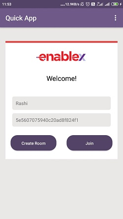
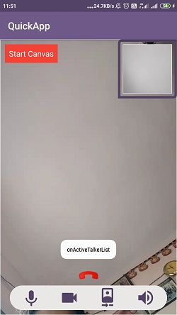
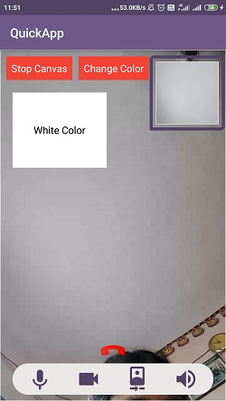
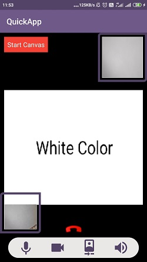
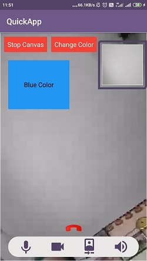
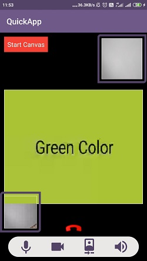

# 1-to-1 RTC: A Sample Android App with EnableX Android Toolkit

The sample Android App demonstrates the use of EnableX (https://www.enablex.io/cpaas/video-api) platform Server APIs and Android Toolkit to build 1-to-1 RTC (Real Time Communication) Application.  It allows developers to ramp up on app development by hosting on their own devices. 

This App creates a virtual Room on the fly  hosted on the Enablex platform using REST calls and uses the Room credentials (i.e. Room Id) to connect to the virtual Room as a Moderator or Participant using a mobile client.  The same Room credentials can be shared with others to join the same virtual Room to carry out a RTC (Real Time Communication) session. 

> EnableX Developer Center: https://developer.enablex.io/


## 1. How to get started

### 1.1 Pre-Requisites

#### 1.1.1 App Id and App Key 

* Register with EnableX [https://portal.enablex.io/cpaas/trial-sign-up/] 
* Login to the EnableX Portal
* Create your Application Key
* Get your App ID and App Key delivered to your Email


#### 1.1.2 Sample Android Client 

* Clone or download this Repository [https://github.com/EnableX/One-to-One-Video-Chat-With-Canvas-Webrtc-Application-Sample-for-Android.git] 


#### 1.1.3 Sample App Server 

* Clone or download this Repository [https://github.com/EnableX/One-to-One-Video-Chat-With-Canvas-Webrtc-Application-Sample-for-Android.git] & follow the steps further 
* You need to use App ID and App Key to run this Service. 
* Your Android Client End Point needs to connect to this Service to create Virtual Room.
* Follow README file of this Repository to setup the Service.


#### 1.1.4 Configure Android Client 

* Open the App
* Go to WebConstants and change the following:
``` 
 String userName = "USERNAME"  /* HTTP Basic Auth Username of App Server */
 String password = "PASSWORD"  /* HTTP Basic Auth Password of App Server */
 String kBaseURL = "FQDN"      /* FQDN of of App Server */
 ```
 
 Note: The distributable comes with demo username and password for the Service. 

### 1.2 Test

#### 1.2.1 Open the App

* Open the App in your Device. You get a form to enter Credentials i.e. Name & Room Id.
* You need to create a Room by clicking the "Create Room" button.
* Once the Room Id is created, you can use it and share with others to connect to the Virtual Room to carry out a RTC Session either as a Moderator or a Participant (Choose applicable Role in the Form).

Note: Only one user with Moderator Role allowed to connect to a Virtual Room.

Note:- If you used any emulator/simulator your local stream will not create. It will create only on real device.
  
## 2 Server API

EnableX Server API is a Rest API service meant to be called from Partners' Application Server to provision video enabled 
meeting rooms. API Access is given to each Application through the assigned App ID and App Key. So, the App ID and App Key 
are to be used as Username and Password respectively to pass as HTTP Basic Authentication header to access Server API.
 
For this application, the following Server API calls are used: 
* https://developer.enablex.io/latest/server-api/rooms-route/#get-rooms - To get list of Rooms
* https://developer.enablex.io/latest/server-api/rooms-route/#get-room-info - To get information of the given Room
* https://developer.enablex.io/latest/server-api/rooms-route/#create-token - To create Token for the given Room

To know more about Server API, go to:
https://developer.enablex.io/latest/server-api/


## 3 Android Toolkit

Android App to use Android Toolkit to communicate with EnableX Servers to initiate and manage Real Time Communications.  

* Documentation: https://developer.enablex.io/latest/client-api/Android-toolkit/
* Download: https://developer.enablex.io/resources/downloads/#Android-toolkit


## 4 Application Walk-through

### 4.1 Create Token

We create a Token for a Room Id to get connected to EnableX Platform to connect to the Virtual Room to carry out a RTC Session.

To create Token, we make use of Server API. Refer following documentation:
https://developer.enablex.io/latest/server-api/rooms-route/#create-token


### 4.2 Connect to a Room, Initiate & Publish Stream

We use the Token to get connected to the Virtual Room. Once connected, we intiate local stream and publish into the room. Refer following documentation for this process:
https://developer.enablex.io/latest/client-api/Android-toolkit/enxrtc/


### 4.3 Play Stream

We play the Stream into EnxPlayerView Object.
``` 
private var enxPlayerView: EnxPlayerView? = null
enxPlayerView = EnxPlayerView(this, EnxPlayerView.ScalingType.SCALE_ASPECT_BALANCED, true)
    
// Attach & render Stream to Player 
localStream!!.attachRenderer(enxPlayerView)

// Add Player to View
yourView?.addView(enxPlayerView)
  ```
More on Player: https://developer.enablex.io/latest/client-api/android-toolkit/basic-functions/#play-stream

### 4.4 Handle Server Events

EnableX Platform will emit back many events related to the ongoing RTC Session as and when they occur implicitly or explicitly as a result of user interaction. We use Call Back Methods to handle all such events.

``` 
/* Example of Call Back Methods */

/* Call Back Method: onRoomConnected 
Handles successful connection to the Virtual Room */ 

void onRoomConnected(EnxRoom enxRoom, JSONObject roomMetaData){
    /* You may initiate and publish stream */
}


/* Call Back Method: onRoomError
 Error handler when room connection fails */
 
void onRoomError(JSONObject jsonObject){

} 

 
/* Call Back Method: onStreamAdded
 To handle any new stream added to the Virtual Room */
 
void onStreamAdded(EnxStream stream){
    /* Subscribe Remote Stream */
} 


/* Call Back Method: onActiveTalkerList
 To handle any time Active Talker list is updated */
  
void onActiveTalkerList(JSONObject jsonObject){
    /* Handle Stream Players */
}
```

### 4.5 Start Canvas

 Enablex Platform provide api to start/stop canvas. 
 To initiate canvas customer must have canvas subscription enable in their room.
 Note:- Right now only one user can share his canvas at any given time in the room. The canvas stream can be edited in real time
 only by the person who started the canvas. Exm:- If in room their are 2 participants 'A' and 'B', If participant 'A' start the canvas then participant 'B' can only view and vice varsa.
       
   
    Method:
    ``` 
        Start Canvas
            public void startCanvas(View view);
            /*
            Here user needs to pass the view, which he/she wants to publish as another stream into the room over the canvas channel. 
            */
        Stop Canvas
           public void startCanvas();
    ``` 
    Delegates:
    ``` 
    /*
        Owner of start/Stop canvas (The person startting/Stoping canvas) will receive acknowledgement delegates as below */
        //Start Canvas
        public void onStartCanvasAck(JSONObject jsonObject);
        //Stop Canvas
        public void onStoppedCanvasAck(JSONObject jsonObject);
    /*
        Other participants in same room will receive delegates as Below */
        //Once Canvas start
        public void onCanvasStarted(EnxStream enxStream);
        //Once Canvas Stopen
        public void onCanvasStopped(EnxStream enxStream);
    ``` 
    
    
 ### Exploring the sample app
   Join Screen :- On this screen user creates the roomID, and share this roomID to other end user who has to join this room.
   
      
    
Here in this screen 2nd participant joins into the same room. On Top of the screen, option button is available to start the  canvas.
       
       
    
   
Once user clicks start canvas, a white page will open, where user can draw, add interactive buttons or play a video etc. In this example we will change the canvas  color and its name on "Change color button tap"

    
    
Changed color from white to Red.

       

Changed color from Red to Blue.

      
      
    
As you can see once any user starts the canvas, users in same room views the activity on the canvas, based on the interactive actions initiated from canvas owner.

## 5 Trial

Try a quick Video Call: https://try.enablex.io/
Sign up for a free trial https://portal.enablex.io/cpaas/trial-sign-up/

